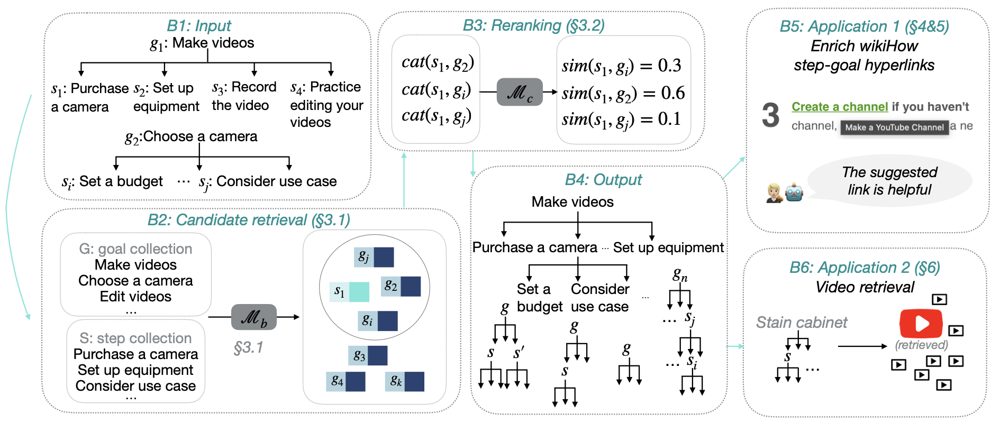

# Discover the Hierarchies of Complex Procedures
The source code and the data for ACL 2022 paper [Show Me More Details: Discovering Hierarchies of Procedures from Semi-structured Web Data](https://arxiv.org/abs/2203.07264)

:robot: [Online demo](https://wikihow-hierarchy.github.io)

## Overview
We develop a simple and effective pipeline to discover the hierarchies of complex procedures.
We apply our pipeline to [wikiHow](https://www.wikihow.com/Main-Page) and construct a hierarchical knowledge base that contains over 110k complex procedures. 
We hope this hierarchical KB could 
* enrich the procedures with detailed information
* bridge the semantic gap between the abstract, under-specified natural language instruction and the low-level, concrete executions of that instruction
* make the complex procedures more accessable to less knowledgable audience (e.g. kids, robots)



## Resource
* Please download the resources from [this]() link
* `data/wikihow_prediction.json`: the dump of all our predictions. 
Each entry has a step and the predicted linked goals. The predictions are ranked the score from the reranker. If the top-1 prediction is `[unused2]`, the step is *unlinkable*. 
* `data/annotated_step_goal.json`: the steps that have hyper-links. These hyper-links are created by wikiHow contributors. 
We further split them to `train` and `dev` splits to train and validate the reranker.
* `data/wikihow.json`: the data crawled from wikiHow. Each entry contains a goal, and the corresponding steps to accomplish the goal

## Train the reranker
```bash
python reranking/train.py \
  --train_null \
  --add_goal \
  --use_para_score \
  --model_name deberta \
  --context_length 1 \
  --train_file ./data/gold.rerank.org.t30.train.json \
  --dev_file ./data/gold.rerank.org.t30.dev.json \
  --gold_step_goal_para_score ./data/gold.para.base.all.score \
  --save_path ./model/deberta.reranker.pt \
  --neg_num 29 --bs 1 \
  --mega_bs 4 --val_bs 1 \
  --min_save_ep 0 \
  --epochs 5
```
* `train_file` `dev_file`: data files that have linkable steps with their top-30 retrieved goals from the retriever.
* `train_null`: explicitly train the model to predict *unlinkable* steps (S3.3)
* `add_goal`: add the goal of the step as the context of the step (S3.2)
* `use_para_score`: add the score from the retrieval process when calculating the reranking score (Eq.2)
* `context_length`: add the surrounding steps of the target step. n defines the window size
* `gold_step_goal_para_score`: the file that stores the score between each step and its ground truth goal. Other scores are stored in the data files already

## Run the reranker on all wikiHow steps
```bash
python reranking/inference.py \
--model_path ./model/deberta.reranker.pt \
--test_path ./data/all_wikihow_step_t30goals.json \
--save_path ./data/all.result \
--no_label
```

* `test_path`: all steps and their top-30 retrieved goals. The whole wikiHow contains more than 1M steps, the best practice is to split the test file to multiple slides and run them in parallel.

## Run the retriever
We provide the top-30 retrieved goals for each step in wikiHow. 
If you want to run the retriever from scratch. Please refer to [Wieting el at](https://github.com/jwieting/paraphrastic-representations-at-scale). 
The basic procedure is
1. extract all steps and goals from `wikihow.json` file 
2. encode them independently with the paraphrase embedding model 
3. use [FAISS](https://github.com/facebookresearch/faiss) to search the nearest k goals for each step. A piece of pseudo code:
```python
import faiss
# goal_embeds: [number_of_goals, embedding_size]
# step_embeds: [number_of_steps, embedding_size]
indexer = faiss.IndexFlatIP(goal_embeds.shape[1])
indexer.add(step_embeds)
D, I = indexer.search(step_embeds, top_k)
# for i-th step
for step_idx, (dist, retrieved_index) in enumerate(zip(D, I)):
    retrieved_goal_list = retrieved_index
    retrieval_score = dist.tolist()
```
## Video retrieval evaluation
We randomly sample 1000 goals from howto100M data 
and split them to the training, dev, test set. 
The data is in `data/video_retrieval`

The code is in `video_retrieval/run.py`. It requires an [Elasticsearch](https://elasticsearch-py.readthedocs.io/en/v8.2.2/api.html) server to run. 
After setting that up, you can assign the value to `HOST` in the code
### Get the helpful steps with the training set
```bash
python video_retrieval/run.py \
--help_version mr \
--mode MODE \
--goal_list ./data/video_retrieval/goal_list.json \
--helpful_file ./data/video_retrieval/all_goal_useful_step.[help_version].json
```
* `--mode 1.1`: filter the helpful steps from the original wikihow steps
* `--mode 1.2`: filter the helpful steps from both the original wikihow steps and the steps from the discovered hierarchies

### Evaluation
```bash
# use the goal only
python video_retrieval/run.py --mode 2 --test_mode 1
# use the goal + children
python video_retrieval/run.py --mode 2 --test_mode 2
# use goal + filtered children
python video_retrieval/run.py \
  --mode 2 \
  --test_mode 5.1 \
  --step_weight 0.5 \
  --help_version mr
# use goal + filtered children + filtered grandchildren
python video_retrieval/run.py \
  --mode 2 \
  --test_mode 5.2 \
  --step_weight 0.5 \
  --help_version mr
```

## Citation
```bibtex
@inproceedings{zhou22acl,
    title = {Show Me More Details: Discovering Hierarchies of Procedures from Semi-structured Web Data},
    author = {Shuyan Zhou and Li Zhang and Yue Yang and Qing Lyu and Ricardo Gonzale and Pengcheng Yin and Chris Callison-Burch and Graham Neubig},
    booktitle = {Annual Conference of the Association for Computational Linguistics (ACL)},
    address = {Dublin, Ireland},
    month = {May},
    year = {2022}
}
```